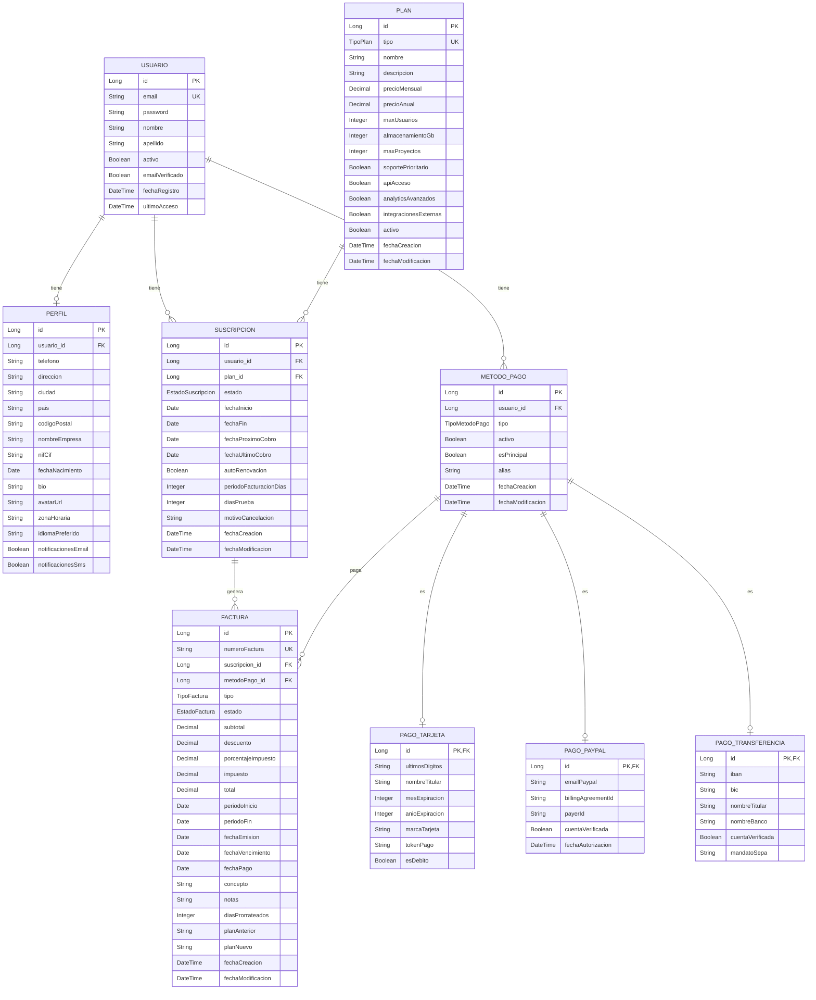

# Diagrama Entidad-Relación - Plataforma SaaS

## Descripción General

Este documento describe el modelo de datos de la plataforma SaaS, incluyendo las entidades principales, sus relaciones y los atributos clave.

## Diagrama E-R (Mermaid)

## Enumeraciones

### EstadoSuscripcion

| Valor     | Descripción                                       |
| --------- | ------------------------------------------------- |
| ACTIVA    | Suscripción activa y al día con los pagos         |
| CANCELADA | Suscripción cancelada por el usuario o el sistema |
| MOROSA    | Suscripción con pagos pendientes                  |
| PAUSADA   | Suscripción pausada temporalmente                 |
| TRIAL     | Suscripción en periodo de prueba                  |

### TipoPlan

| Valor      | Nivel | Descripción                  |
| ---------- | ----- | ---------------------------- |
| BASIC      | 1     | Plan Básico - €9.99/mes      |
| PREMIUM    | 2     | Plan Premium - €29.99/mes    |
| ENTERPRISE | 3     | Plan Enterprise - €99.99/mes |

### EstadoFactura

| Valor       | Descripción                             |
| ----------- | --------------------------------------- |
| PENDIENTE   | Factura generada pero pendiente de pago |
| PAGADA      | Factura pagada correctamente            |
| VENCIDA     | Factura vencida sin pagar               |
| CANCELADA   | Factura cancelada                       |
| REEMBOLSADA | Factura reembolsada                     |

### TipoFactura

| Valor     | Descripción                              |
| --------- | ---------------------------------------- |
| MENSUAL   | Factura mensual regular                  |
| PRORRATEO | Factura por prorrateo al cambiar de plan |
| AJUSTE    | Factura de ajuste o corrección           |
| REEMBOLSO | Nota de crédito                          |

### TipoMetodoPago

| Valor                  | Descripción            |
| ---------------------- | ---------------------- |
| TARJETA_CREDITO        | Tarjeta de Crédito     |
| TARJETA_DEBITO         | Tarjeta de Débito      |
| PAYPAL                 | PayPal                 |
| TRANSFERENCIA_BANCARIA | Transferencia Bancaria |

## Estrategias de Herencia

### MetodoPago (JOINED)

La entidad `MetodoPago` utiliza la estrategia de herencia **JOINED**, lo que significa:

- Existe una tabla base `metodos_pago` con los atributos comunes
- Cada subtipo tiene su propia tabla (`pagos_tarjeta`, `pagos_paypal`, `pagos_transferencia`)
- Las tablas hijas se relacionan con la tabla padre mediante clave foránea

**Ventajas:**

- Normalización de datos
- Sin columnas nulas innecesarias
- Facilita añadir nuevos tipos de pago

## Auditoría con Hibernate Envers

Todas las entidades principales están anotadas con `@Audited`, lo que genera:

- Tablas de auditoría con sufijo `_AUD`
- Registro de cada modificación con número de revisión
- Información del usuario que realizó el cambio (mediante `CustomRevisionEntity`)

### Tablas de Auditoría Generadas

- `usuarios_AUD`
- `perfiles_AUD`
- `planes_AUD`
- `suscripciones_AUD`
- `facturas_AUD`
- `metodos_pago_AUD`
- `pagos_tarjeta_AUD`
- `pagos_paypal_AUD`
- `pagos_transferencia_AUD`
- `revinfo` (tabla de revisiones)

## Reglas de Negocio Implementadas

1. **Generación automática de facturas**: Cada 30 días (configurable por `periodoFacturacionDias`)
2. **Prorrateo en upgrades**: Cuando un usuario cambia a un plan más caro, se genera una factura de prorrateo
3. **Un usuario solo puede tener una suscripción activa a la vez**
4. **Las facturas incluyen IVA del 21% por defecto**
5. **Los números de factura se generan automáticamente**
