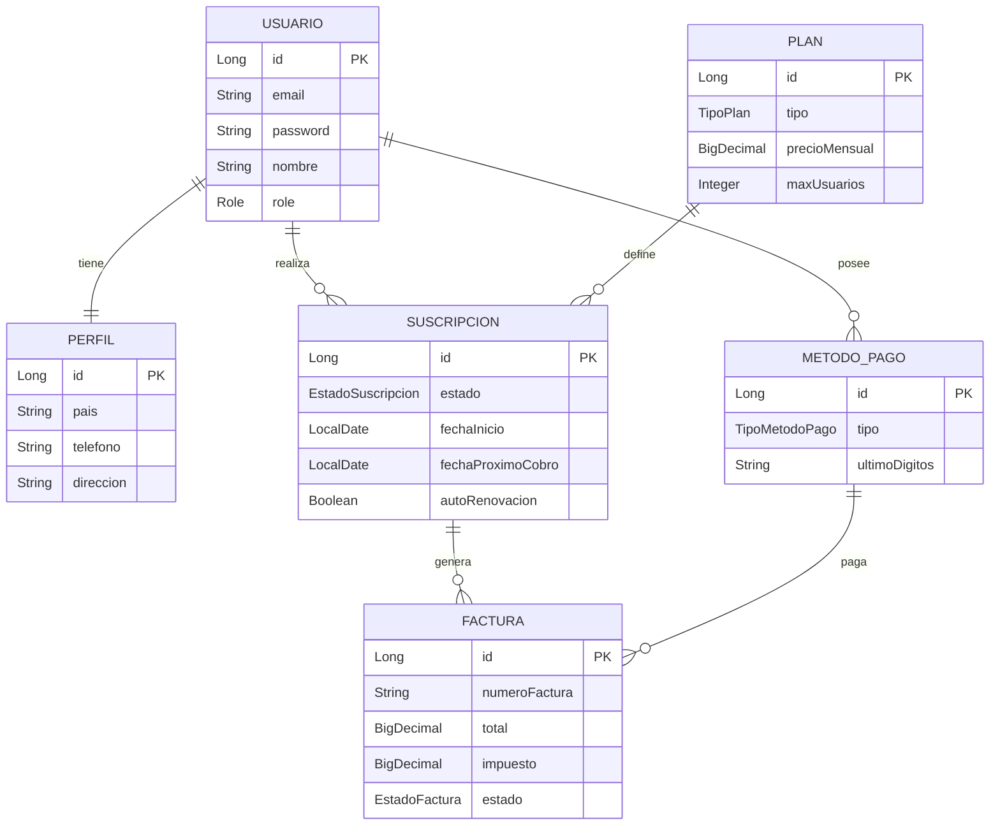

# Diagrama Entidad-Relación (ER)

```mermaid
erDiagram
    USUARIO ||--|| PERFIL : "tiene"
    USUARIO ||--o{ SUSCRIPCION : "realiza"
    USUARIO ||--o{ METODO_PAGO : "posee"
    PLAN ||--o{ SUSCRIPCION : "define"
    SUSCRIPCION ||--o{ FACTURA : "genera"
    METODO_PAGO ||--o{ FACTURA : "paga"

    USUARIO {
        Long id PK
        String email
        String password
        String nombre
        Role role
    }

    PERFIL {
        Long id PK
        String pais
        String telefono
        String direccion
    }

    PLAN {
        Long id PK
        TipoPlan tipo
        BigDecimal precioMensual
        Integer maxUsuarios
    }

    SUSCRIPCION {
        Long id PK
        EstadoSuscripcion estado
        LocalDate fechaInicio
        LocalDate fechaProximoCobro
        Boolean autoRenovacion
    }

    FACTURA {
        Long id PK
        String numeroFactura
        BigDecimal total
        BigDecimal impuesto
        EstadoFactura estado
    }

    METODO_PAGO {
        Long id PK
        TipoMetodoPago tipo
        String ultimoDigitos
    }
```
